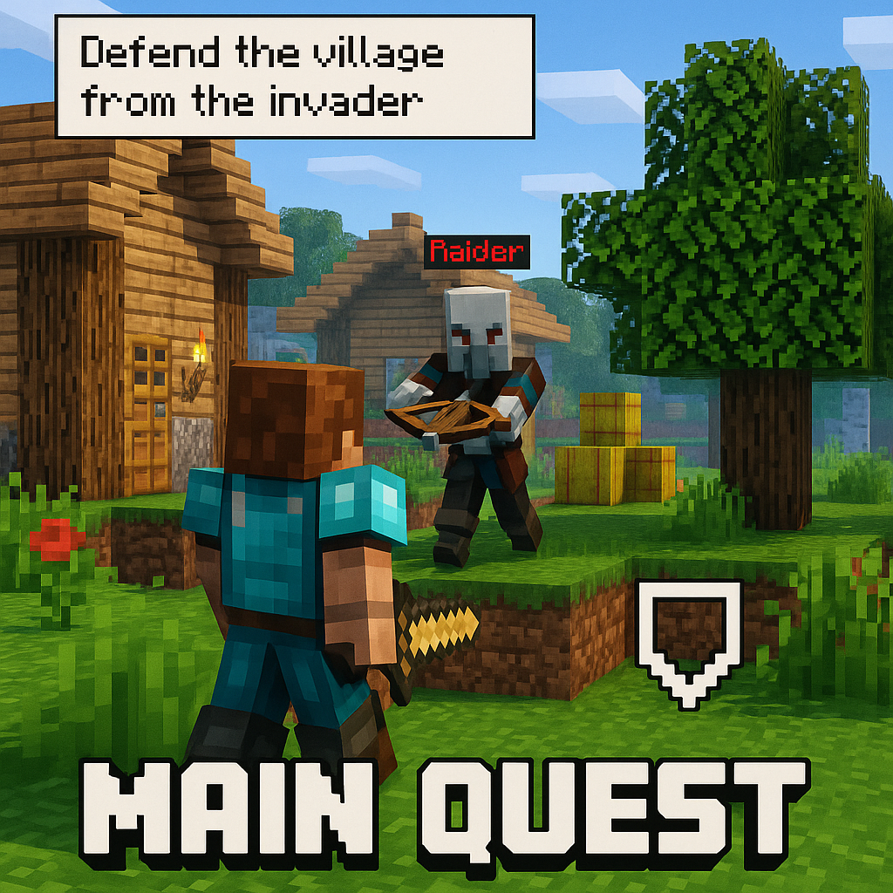

# JX MainQuest Mod - Trigger & Stage System



This mod lets you create a main quest system without having to use command blocks and forget where you put them..


# Documentation

This guide provides detailed documentation and examples for using the `jxmainquest` mod's stage/trigger system.  
Each quest stage has a `trigger` object, which determines when the player progresses to the next stage.

*The JSON file you need to edit is located here:*
```
config\jxmainquest\stages.json
```

---

## Structure Overview

A single stage JSON object looks like this:

```json
{
  "text": "Quest description shown in the HUD",
  "trigger": {
    "type": "...",           // Type of trigger
    "set_time": "day",       // Optional (day, noon, night, midnight)
    "set_weather": "clear",  // Optional (clear, rain, thunder)
    ...                      // Additional fields depending on type
  }
}
```

---

## Trigger Types

### 1. `location`

Advances when the player is within a given radius of a location.

```json
{
  "text": "Find the entrance to Diagon Alley",
  "trigger": {
    "type": "location",
    "x": 150,
    "y": 65,
    "z": -30,
    "radius": 5
  }
}
```

---

### 2. `item`

Advances when the player has specific items in their inventory.  
Supports extra required and/or alternate items:

```json
{
  "text": "Collect your wand materials",
  "trigger": {
    "type": "item",
    "item": "minecraft:stick"
  }
}
```

Player needs 3 stone and 3 feathers

```json
{
  "text": "Example 2",
  "trigger": {
    "type": "item",
    "item": "minecraft:stone:3",
    "anditem1": "minecraft:feather:3"
  }
}
```

Player needs either a stone or a feather

```json
{
  "text": "Example 3",
  "trigger": {
    "type": "item",
    "item": "minecraft:stone",
    "oritem1": "minecraft:feather"
  }
}
```
[required]
* `item` = base item (with optional amount)
[optional]
* `anditemX` = all required
* `oritemX` = at least one required

---

### 3. `locationitem`

A combination of location and item — the player must be at the specified location **and** have the required items.

```json
{
  "text": "Deliver ingredients to the cauldron",
  "trigger": {
    "type": "locationitem",
    "x": 200,
    "y": 63,
    "z": -100,
    "radius": 4,
    "item": "hexerei:willow_log:2"
  }
}
```

---

### 4. `interaction`

Triggered when the player right-clicks a specific named NPC.  
Can include dialogue and auto-spawns the NPC.

```json
{
  "text": "Talk to Hagrid",
  "trigger": {
    "type": "interaction",
    "npc_name": "Hagrid",
    "x": 373,
    "y": -41,
    "z": -142,
    "dir": 90,
    "profession": "nitwit",
    "entity_type": "minecraft:villager",
    "dialogue": [
      { "npc": "You're a wizard, Harry." },
      { "player": "I'm a what?" },
      { "npc": "A wizard. And a thumpin' good one, once you train up a bit." },
      {
        "player_choices": ["Seriously?", "I think you've got the wrong person."],
        "npc_responses": [
          "Dead serious. An' I've come to get you.",
          "No mistake. You’re Harry Potter — and there's a lot you don't know."
        ]
      },
      { "npc": "Pack up. We’ve got business at Diagon Alley." }
    ]
  }
}
```

NPC will automatically spawn at the location and despawn/reset when needed.  
Progression happens after the final dialogue line.
Player choice progress is made by simply pressing the suggested key (1,2,3) (do not type it in chat .. just press it)
---

### 5. `enemy`

Triggered when a specific entity is killed.  
Supports optional name match, radius, direction, rewards, and weather/time.

```json
{
  "text": "Defeat the Acromantula",
  "trigger": {
    "type": "enemy",
    "enemy": "minecraft:spider",
    "enemy_name": "Acromantula",
    "x": 707,
    "y": 6,
    "z": 330,
    "dir": 180,
    "enemy_radius": 10,
    "reward_item": "hexerei:blood_bottle",
    "reward_amount": 1,
    "reward_xp": 20
  }
}
```

enemy BOSS

```json
{
"text": "Defeat the Lich",
"trigger": {
"type": "enemy",
"enemy": "graveyard:lich",
"enemy_name": "Lich",
"x": 1170,
"y": 64,
"z": 4351,
"enemy_radius": 15,
"reward_xp": 40,
"boss": true
}
},
```

- The enemy is automatically spawned (unless `spawn_enemy: false` is added).  
- Rewards are dropped **from the entity**.  
- Kills from any cause (e.g., fire, projectile) count.
- If "boss":true is used multiple rewards are given.
- For bossfights everyone who joins the fight will not trigger another mob spawn.
- You can spawn multiple enemies using "enemy": "minecraft:zombie:3"

---

### 6. `waypoint`

Identical to `location`, but does not trigger a quest completion every time.

```json
{
  "text": "Approach the castle silently",
  "trigger": {
    "type": "waypoint",
    "x": 625,
    "y": 70,
    "z": -180,
    "radius": 3,
    "set_time": "midnight",
    "set_weather": "thunder"
  }
}
```

- Used for passive progress points

---

## Optional Trigger Fields (Global)

These work on any trigger type:

| Field        | Description                          |
|--------------|--------------------------------------|
| `set_time`   | `"day"`, `"noon"`, `"night"`, `"midnight"` |
| `set_weather`| `"clear"`, `"rain"`, `"thunder"`     |
| `dir`        | Yaw rotation in degrees (for NPCs or enemies) |

---

## Quest Flow

- Triggers are evaluated every tick (except `interaction`)
- Progression resets NPCs, mob tracking, and player state per stage
- Only one stage is active at a time

---

## Debug Commands

All developer/testing commands use `/jxmq`.

| Command                          | Description                                                                 |
|----------------------------------|-----------------------------------------------------------------------------|
| `/jxmq reload`                  | Reloads `stages.json` from disk (server-side)                              |
| `/jxmq stage`                   | Displays the current stage index for the player                            |
| `/jxmq stage set <n>`           | Force-sets the stage index (bypasses triggers, useful for testing)         |
| `/jxmq stage back`              | Moves the player one stage backward (also resets interaction/enemy state)  |
| `/jxmq stage advance`           | Moves the player one stage forward manually                                |
| `/jxmq list`                    | Lists all defined story stages (with names and indexes)                    |
| `/jxmq debug`                   | Shows internal tracker state (interactions, enemies, etc.) for the player  |
| `/jxmq unmark`                  | Clears enemy kill progress and/or interaction lock for the current stage   |

---

## Rewards

Any trigger type can define rewards using:

```json
"reward_item": "minecraft:emerald",
"reward_amount": 1,
"reward_xp": 10
```

- `reward_item` — item ID (optionally with `:amount`, or use `reward_amount`)
- `reward_xp` — experience points to award

### Behavior:
- For `enemy` triggers, rewards **drop from the killed mob**
- For all other triggers (`item`, `location`, `interaction`, etc.), rewards are **given directly to the player**

---

## Notes

- `item`, `anditemX`, `oritemX` support `:amount` suffixes
- Up to:
  - 9 `anditemX`
  - 9 `oritemX` 

